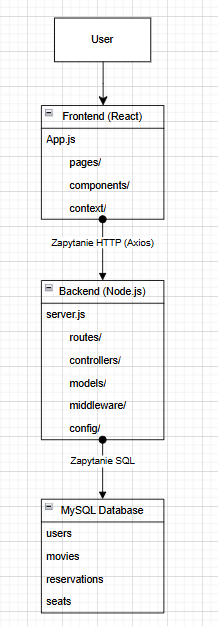
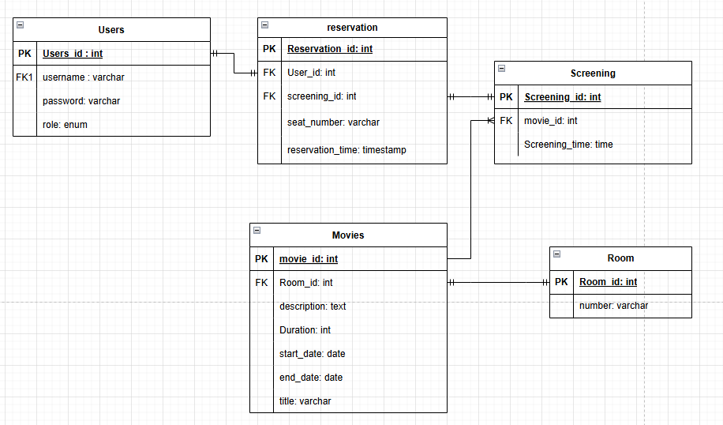

### 1. Opis Projektu
Zaimplementowany projekt jest aplikacją do zarzadzania kinem. Zakres zaimplemetowanych funkcjonalnosci obejmował:
- Rejestracje nowych kont z przydzieloną rolą
- Logowanie z uzyciem sesji i tokenów JWT
- Obsługe różnych ról uzytkowników i ich uprawnień
- Stworzenie widoku wirtualnej sali kinowej z zarządzaniem ją z różnych perspektyw
- Stworzenie tablicy z aktualnie wyświetlanymi filmami wraz z mozliwością jej edycji

### 2. Schematy architektury
   na ponizszym schemacie znajduje się schemat architektury wykorzystywany w projekcie

  

   na ponizszym schemacie znajduje się schemat utworzonej bazy danych wykorzystywanej w projekcie

  
  
### 3. Instrukcja uruchomienia
Baza danych
Aby utworzyc baze danych należy wykonać zapytania umieszczone w pliku database.db w panelu phpMyAdmin
Backend
W celu uruchomienia backendu należy wejść do folderu w którym znajduje się backend następnie wykonac polecenie:

  node .\server.js
Frontend
W celu uruchomienia frontendu należy wejść do folderu w którym znajduje się frontend następnie wykonac polecenie:

  npm start
Testy
Aby uruchomic testy nalezy w folderze z projektem wpisac polecenie:

  npm test
### 4. technologie
Wykorzystanymi technologiami w projekcie są między innymi;
- React to biblioteka JavaScript stworzona przez Facebooka, służąca do budowania interfejsów użytkownika w aplikacjach webowych. Działa w przeglądarce i pozwala na tworzenie dynamicznych i responsywnych komponentów.
  React został użyty do stworzenia części frontendowej aplikacji – czyli interfejsu użytkownika, przez który użytkownicy wchodzą w interakcję z systemem (np. przeglądają filmy, rezerwują bilety). Komponenty Reacta odpowiadają za dynamiczne wyświetlanie danych i 
  zarządzanie stanem aplikacji w przeglądarce.Zaletami jego wykorzystania są między innymi:
  - Umożliwia szybkie i modułowe tworzenie złożonych interfejsów.
  - Reaguje na zmiany danych bez przeładowywania strony.
  - Ułatwia zarządzanie stanem aplikacji (np. logowanie, autoryzacja).
  - Duża społeczność i szeroka dostępność bibliotek.
- Node.js to środowisko uruchomieniowe dla JavaScript, które pozwala uruchamiać kod JS poza przeglądarką – głównie po stronie serwera. Node.js został wykorzystany do stworzenia backendu aplikacji serwera, który zarządza logiką systemu, łączy się z bazą danych, obsługuje zapytania HTTP (np. logowanie, pobieranie filmów) i zapewnia komunikację z frontendem. Głównymi jego zaletami są:
  - Umożliwia użycie JavaScriptu zarówno po stronie klienta, jak i serwera.
  - Jest lekki, szybki i dobrze sprawdza się w aplikacjach typu API.
  - Posiada rozbudowany ekosystem modułów.
- npm to menedżer pakietów dla Node.js służy do instalowania i zarządzania bibliotekami oraz zależnościami w projekcie. Za pomocą npm zainstalowano wszystkie potrzebne biblioteki (np.  React, bcrypt, jsonwebtoken) i skonfigurowano środowisko do uruchamiania i testowania aplikacji. Zaletami jego uzycia są:
  - Ułatwia szybkie dodawanie zewnętrznych narzędzi i bibliotek.
  - Automatycznie zarządza zależnościami projektu.
  - Umożliwia prostą konfigurację skryptów (np. uruchamianie testów, budowanie aplikacji).
